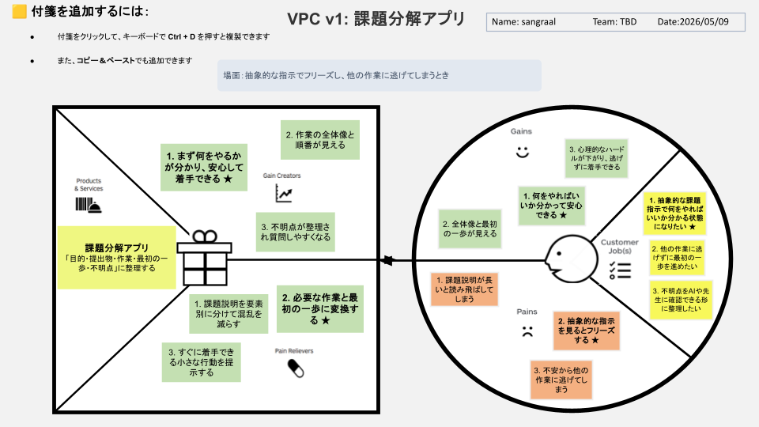

# VPC v1 - sangraal123

> 「**自分や周りの人を顧客に設定**」したVPC。13週後の自分が欲しいもの・身近な人のために作りたいものを設計する。
> v1 でいい。完璧を目指さない。第6回でアップデート(v2)します。

---

## 1. 解決したい困りごとを 1つ 選ぶ

> [`bug-list.md`](./bug-list.md) の20個から、**「自分が一番これを解決したい!」と思うもの** を1つ選んでください。
> 1つに絞れなければ、複数候補を書いてOK(後で絞り込みます)。

**選んだ困りごと**:

14. 抽象的な指示を理解して、具体的なタスクに分解するのが苦手で、難しい指示を受けると何から始めればいいか分からずフリーズしてしまう。

---

## 2. その解決策のアイデアを書く

> 選んだ困りごとに対する「**こうだったらいいのに**」を1つ書く。
> 現実性は気にせず、自由に発想。

**解決のアイデア**:

抽象的な指示を「目的・提出物・作業・最初の一歩・不明点」に整理してくれて、最初の一歩がすぐに着手できる形になる課題分解アプリ。

---

## 3. VPC本体

> 上で選んだ「困りごと」と「解決のアイデア」を起点に、6要素を埋めていきます。

### 🟦 Customer Profile(顧客=自分自身)

#### Jobs(やりたいこと・動詞で書く)

- 1. 抽象的な課題指示で何をやればいいか分かる状態になりたい ★
- 2. 他の作業に逃げずに最初の一歩を進めたい
- 3. 不明点をAIや先生に確認できる形に整理したい

#### Pains(困っていること)

- 1. 課題説明が長いと読み飛ばしてしまう
- 2. 抽象的な指示を見るとフリーズする ★
- 3. 不安から他の作業に逃げてしまう

#### Gains(得たい未来・状態)

- 1. 何をやればいいか分かって安心できる ★
- 2. 全体像と最初の一歩が見える
- 3. 心理的なハードルが下がり、逃げずに着手できる

---

### 🟧 Value Map(あなたが作るもの)

#### Products & Services

- 課題分解アプリ 「目的・提出物・作業・最初の一歩・不明点」に整理する

#### Pain Relievers

- 1. 課題説明を要素別に分けて混乱を減らす
- 2. 必要な作業と最初の一歩に変換する ★
- 3. すぐに着手できる小さな行動を提示する

#### Gain Creators

- 1. まず何をやるかが分かり、安心して着手できる ★
- 2. 作業の全体像と順番が見える
- 3. 不明点が整理され質問しやすくなる

---

## 4. Fit確認(整合チェック)

| Pains/Gains | ↔ | Pain Relievers / Gain Creators | チェック |
|---|---|---|---|
| Pain ② 抽象的な指示を見るとフリーズする | ↔ | Pain Reliever ② 必要な作業と最初の一歩に変換する | ✓ |
| Gain ① 何をやればいいか分かって安心できる | ↔ | Gain Creator ① まず何をやるかが分かり、安心して着手できる | ✓ |
| Pain ① 課題説明が長いと読み飛ばしてしまう | ↔ | Pain Reliever ① 課題説明を要素別に分けて混乱を減らす | ✓ |
| Gain ② 全体像と最初の一歩が見える | ↔ | Gain Creator ② 作業の全体像と順番が見える | ✓ |
| Gain ③ 心理的なハードルが下がり、逃げずに着手できる | ↔ | Gain Creator ③ 不明点が整理され質問しやすくなる | ✓ |

> 整合しないものは「自分が作りたいだけ」のプロダクトになりがち。
> 迷ったら AI大学講師に壁打ち。
